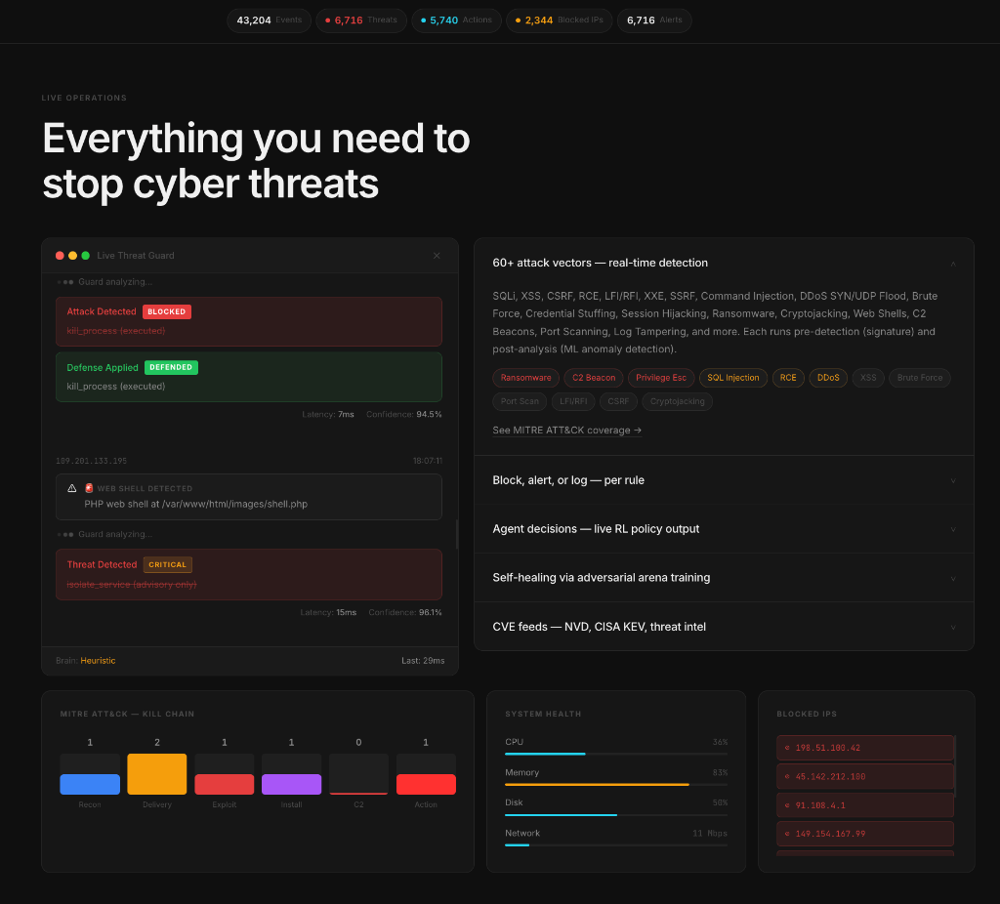
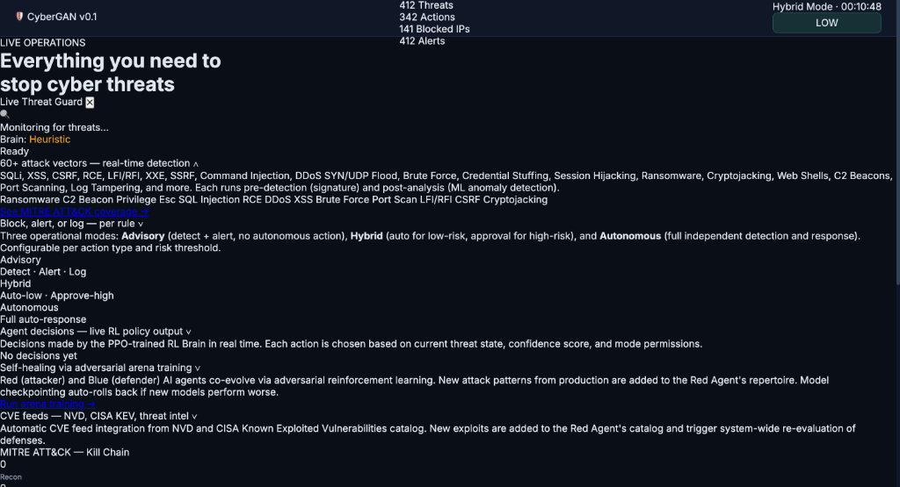

<div align="center">

# CyberGAN

### AI-Powered Autonomous Cybersecurity Agent

*Adversarial RL co-evolution for real-world server defense — not a demo, not a simulation.*

[**Quick Start**](#-quick-start) · [**WAF Integration**](#-waf-middleware) · [**Docker**](#-docker-deployment) · [**Train**](#-train-the-rl-model) · [**Architecture**](#-architecture)

<br/>



*Live SOC Dashboard — real-time threat feed, MITRE ATT&CK kill chain, RL policy decisions*

<br/>



*Live agent output — 412 threats detected, 141 IPs blocked, Brain: Heuristic → RL Policy after training*

</div>

---

## What is CyberGAN?

CyberGAN is a **production-grade AI security agent** that monitors your server in real time and responds to threats autonomously. It is built around a GAN-inspired architecture where a **Red Agent** (attacker) and a **Blue Agent** (defender) co-evolve through adversarial reinforcement learning (PPO). The trained Blue policy is then deployed to protect real servers.

**It is real.** Every event you see comes from actual system telemetry:

| What you see | What generates it |
|---|---|
| CPU / Memory / Disk / Network | `psutil` reading your live system |
| SSH / sudo / auth events | Native `log stream` on macOS, `/var/log/auth.log` on Linux |
| File system changes | `watchdog` monitoring `/etc`, `/usr/bin`, SSH keys |
| Process threats | Per-process scan — cryptominer / reverse shell patterns |
| WAF blocks | Real HTTP 403s on actual attack payloads |
| RL decisions | PPO policy trained to Blue ELO **1372** in adversarial arena |

---

## ✨ Features

- **🧠 Trained RL Brain** — PPO Blue Agent, ELO 1372 vs Red ELO 628, 279W/21L in 300 epochs
- **🔥 WAF Middleware** — Drop-in ASGI middleware for FastAPI/Starlette. 62 patterns, **100% block rate** against real attack payloads
- **👁️ 6 Real-time Monitors** — Log stream, network, file system, process, web, system metrics
- **🛡️ 60+ Attack Vectors** — SQLi, XSS, CSRF, RCE, LFI, SSRF, SSTI, DDoS, cryptojacking, reverse shells, ransomware, and more
- **🖥️ Live SOC Dashboard** — WebSocket-powered dashboard with kill chain, threat feed, ELO graph, system health
- **🐳 Docker Ready** — One-command deploy to any Linux server
- **🍎 macOS Native** — Uses `log stream`, `pf` firewall, graceful fallback for non-root
- **⚔️ Self-Healing Arena** — Continuously retrains against new attack patterns
- **📣 Alerting** — Slack, Discord, PagerDuty webhooks

---

## 🏗️ Architecture

```
┌──────────────────────────────────────────────────────────────────────┐
│                         CyberGAN System                              │
│                                                                      │
│  ┌─────────────────────────────── PERCEPTION ───────────────────┐   │
│  │  log_monitor  network_monitor  file_monitor  process_monitor  │   │
│  │  web_monitor              system_metrics                      │   │
│  └───────────────────────────────┬───────────────────────────────┘   │
│                                  │ real events                        │
│  ┌──────────────── ANALYSIS ─────▼──────────────────────────────┐   │
│  │  feature_extractor → risk_scorer → threat_classifier          │   │
│  │  attack_signatures (62 patterns)   anomaly_detector           │   │
│  └──────────────────────────────┬────────────────────────────────┘   │
│                                  │ observation vector                  │
│  ┌──────────────── BRAIN ────────▼──────────────────────────────┐   │
│  │  PPO Blue Policy (ELO 1372)  ←→  Heuristic fallback          │   │
│  │  arena_obs_dim=74  prod_obs_dim=65  (auto-bridged)            │   │
│  └──────────────────────────────┬────────────────────────────────┘   │
│                                  │ defense action                      │
│  ┌──────────────── ACTIONS ──────▼──────────────────────────────┐   │
│  │  firewall (iptables/pf)  ip_blocker  process_control          │   │
│  │  waf  alerter  honeypot  service_control  patcher             │   │
│  └──────────────────────────────┬────────────────────────────────┘   │
│                                  │                                     │
│  ┌──────────────── DASHBOARD ────▼──────────────────────────────┐   │
│  │  FastAPI + WebSocket  →  Real-time SOC  :8443                │   │
│  └──────────────────────────────────────────────────────────────┘   │
└──────────────────────────────────────────────────────────────────────┘

┌─────────────────────── ARENA TRAINING ──────────────────────────────┐
│  Red Agent (PPO)  ⚔️  co-evolve  ⚔️  Blue Agent (PPO)               │
│  300 epochs · 0.5s/epoch · Blue 279W/21L · ELO gap: 744 points      │
└──────────────────────────────────────────────────────────────────────┘

┌─────────────────────── WAF MIDDLEWARE ──────────────────────────────┐
│  HTTP Request → CyberGANMiddleware → Pattern Match (62 rules)        │
│     → BLOCK (403) or PASS → Dashboard broadcast → Slack/Discord      │
└──────────────────────────────────────────────────────────────────────┘
```

---

## 🚀 Quick Start

### Prerequisites

```bash
Python 3.11+
pip install -r requirements.txt
```

### 1. Run the Agent + Dashboard (combined)

```bash
# Recommended: advisory mode — see all detections, no auto-blocking
python main.py run --mode advisory --dashboard

# Hybrid: auto-block low-risk, alert for high-risk
python main.py run --mode hybrid --dashboard

# Fully autonomous: RL policy acts on every threat
python main.py run --mode autonomous --dashboard
```

Open **http://localhost:8443** — the live SOC dashboard.

### 2. Train the RL Model

```bash
python train.py --epochs 300
```

Training streams live to the dashboard. Results after 300 epochs (~3 min on CPU):

```
Blue ELO: 1372  (279W / 21L / 0D)
Red  ELO:  628  ( 21W / 279L / 0D)
Checkpoint: checkpoints/blue_production.pt
```

After training, restart the agent — it automatically loads the RL policy.

### 3. Test the WAF

```bash
# Start the WAF-protected demo app
python demo_app.py

# Fire 47 real attack payloads
python attack_tester.py
```

Expected output:
```
Total attacks:  47
Blocked by WAF: 47  (100%)
  SQLi   7/7  🛑   XSS    7/7  🛑   LFI    7/7  🛑
  RCE    8/8  🛑   SSRF   7/7  🛑   SSTI   4/4  🛑
  Recon  7/7  🛑
```

---

## 🔥 WAF Middleware

Add production-grade WAF protection to **any FastAPI or Starlette app** in 3 lines:

```python
from fastapi import FastAPI
from cybergan_waf import CyberGANMiddleware

app = FastAPI()

app.add_middleware(
    CyberGANMiddleware,
    mode="block",                           # block | log | alert
    dashboard_url="ws://localhost:8443/ws", # stream to CyberGAN dashboard
    rate_limit_per_minute=60,
    slack_webhook="https://hooks.slack.com/...",   # optional
    discord_webhook="https://discord.com/api/...", # optional
)
```

### Attack Coverage (62 patterns across 11 categories)

| Category | Patterns | Example |
|---|---|---|
| SQL Injection | 8 | `' UNION SELECT`, `OR 1=1`, `SLEEP(5)` |
| XSS | 7 | `<script>`, `onerror=`, `javascript:` |
| Local File Inclusion | 7 | `../etc/passwd`, `php://filter` |
| Remote Code Execution | 8 | `;ls -la`, `\`whoami\``, `eval(` |
| SSRF | 7 | `169.254.169.254`, `file://`, `dict://` |
| SSTI | 5 | `{{7*7}}`, `${7*7}`, `<#assign` |
| Command Injection | 5 | `&& cat`, `\| nc`, `; curl` |
| Scanner / Recon | 5 | `/.git/config`, `/.env`, `/wp-admin` |
| XXE | 4 | `<!ENTITY`, `SYSTEM "file://` |
| Web Shell | 3 | `c99.php`, `r57.php`, `eval($_POST` |
| Header Injection | 3 | CRLF `\r\n`, Host header poisoning |

### WAF Modes

| Mode | Behavior |
|---|---|
| `block` | Returns HTTP 403 immediately, logs the attack |
| `alert` | Passes the request through, sends alert to dashboard/Slack |
| `log` | Passes through silently, stores in internal log |

---

## 🧠 RL Training — How It Works

CyberGAN uses **Proximal Policy Optimization (PPO)** in an adversarial co-evolution loop:

```
┌──────────────────────────────────────────────┐
│          Adversarial Arena Loop              │
│                                              │
│  Red Agent (attacker)                        │
│  ├─ Scans network nodes                      │
│  ├─ Exploits vulnerabilities                 │
│  └─ Pivots to gain control                   │
│           ⬇ attack                           │
│  Blue Agent (defender) ← YOU deploy this     │
│  ├─ Patches vulnerabilities                  │
│  ├─ Isolates compromised nodes               │
│  └─ Monitors for anomalies                   │
│           ⬇ outcome                          │
│  PPO update for both agents                  │
│  ELO ratings updated                         │
│  League checkpoint saved if win_rate > 60%   │
└──────────────────────────────────────────────┘
```

| Hyperparameter | Value |
|---|---|
| Algorithm | PPO (clip ε=0.2) |
| Network | 256→256→128 (LayerNorm, ReLU) |
| Gamma | 0.99 |
| GAE λ | 0.95 |
| Entropy coef | 0.01 |
| PPO epochs | 4 |
| Steps/episode | 64 |
| Episodes/epoch | 8 |

---

## 🖥️ Dashboard

Live SOC dashboard at **http://localhost:8443**

| Widget | Data source |
|---|---|
| Event / Threat / Action counters | Real agent stats |
| System Health (CPU/RAM/Disk/Net) | `psutil` — real machine metrics |
| Live Threat Feed | Real events from 6 monitors |
| Arena Training Panel | Live ELO + win rate during `train.py` |
| MITRE ATT&CK Kill Chain | Classified threat categories |
| Blocked IPs | Real firewall blocks |
| Brain indicator | "Heuristic" vs "RL Policy" |

---

## 🐳 Docker Deployment

### Option A — Docker Compose (recommended)

```bash
# Clone and deploy
git clone https://github.com/Alphabeast1707/CyberGan.git
cd CyberGan

# Copy env template
cp .env.example .env
# Edit .env to set CYBERGAN_MODE, SLACK_WEBHOOK, etc.

# Start agent + dashboard
docker compose up -d cybergan

# Check status
docker compose ps
docker logs -f cybergan-agent
```

### Option B — One-command deploy script

```bash
# On any Ubuntu/Debian server (installs Docker if needed)
git clone https://github.com/Alphabeast1707/CyberGan.git
cd CyberGan
chmod +x deploy.sh

./deploy.sh --mode hybrid --train
#           ↑               ↑
#           agent mode      train RL model first (recommended)
```

The script:
1. Installs Docker if not present
2. Builds the image (`cybergan:latest`)
3. Trains the RL model (optional, `--train`)
4. Starts the agent with dashboard
5. Waits for healthcheck
6. Prints your dashboard URL

### Option C — Manual Docker

```bash
docker build -t cybergan:latest .

docker run -d \
  --name cybergan \
  --cap-add NET_ADMIN \
  --cap-add NET_RAW \
  -v /var/log:/host/var/log:ro \
  -v cybergan_data:/var/lib/cybergan \
  -p 8443:8443 \
  cybergan:latest run --mode hybrid --dashboard
```

### Run the trainer as a one-off job

```bash
docker compose run --rm trainer
# or
docker compose --profile training up trainer
```

---

## 📁 Project Structure

```
CyberGan/
│
├── main.py                       # CLI entry: run | train | scan | dashboard
├── train.py                      # Standalone trainer with dashboard broadcast
├── demo_app.py                   # FastAPI app protected by CyberGAN WAF
├── attack_tester.py              # Fires 47 real attack payloads at demo_app
├── requirements.txt
│
├── config/
│   ├── default.yaml              # All configuration (monitors, brain, RL, alerts)
│   ├── checkpoints/              # Trained model weights
│   └── logs/                     # Training logs (JSON)
│
├── cybergan/                     # ── PRODUCTION AGENT ──
│   ├── agent.py                  # Main daemon: event loop, action dispatch
│   ├── config.py                 # Pydantic settings with platform auto-detection
│   ├── perception/
│   │   ├── log_monitor.py        # Tails syslog / macOS log stream in real time
│   │   ├── network_monitor.py    # Connection spike, port scan detection
│   │   ├── file_monitor.py       # Watchdog on /etc, /usr/bin, SSH keys
│   │   ├── process_monitor.py    # Per-process: cryptominer, reverse shell
│   │   ├── system_metrics.py     # CPU/RAM/disk/net via psutil
│   │   └── web_monitor.py        # Web log parser / access log monitor
│   ├── analysis/
│   │   ├── feature_extractor.py  # Raw events → fixed observation vector
│   │   ├── risk_scorer.py        # 0–100 risk score with decay
│   │   ├── threat_classifier.py  # MITRE ATT&CK classification
│   │   ├── attack_signatures.py  # Signature-based detection
│   │   └── anomaly_detector.py   # Statistical anomaly detection
│   ├── brain/
│   │   ├── policy.py             # PPO policy + arena↔production adapter
│   │   ├── action_space.py       # Defense action definitions
│   │   └── observer.py           # Observation builder for RL inference
│   ├── actions/
│   │   ├── firewall.py           # iptables (Linux) / pf (macOS) + root fallback
│   │   ├── ip_blocker.py         # In-memory + firewall IP blocklist
│   │   ├── process_control.py    # Kill processes by PID
│   │   ├── alerter.py            # Slack / Discord / PagerDuty
│   │   ├── waf.py                # WAF rule applicator
│   │   ├── honeypot.py           # Honeypot deployment
│   │   └── service_control.py    # Start/stop/restart services
│   ├── healing/
│   │   ├── arena_trainer.py      # Background arena training
│   │   ├── online_learner.py     # Online RL from real incidents
│   │   ├── threat_intel.py       # NVD / CISA KEV feed integration
│   │   └── checkpoint_manager.py # Auto-rollback on performance drop
│   └── dashboard/
│       ├── server.py             # FastAPI + WebSocket SOC server
│       └── static/               # index.html, app.js, index.css
│
├── cybergan_waf/                 # ── WAF MIDDLEWARE ──
│   ├── __init__.py               # Public API: CyberGANMiddleware, scan()
│   ├── middleware.py             # ASGI middleware (block/log/alert modes)
│   ├── patterns.py               # 62 attack regex patterns (11 categories)
│   └── reporter.py               # Non-blocking reporter: dashboard + webhooks
│
├── arena/                        # ── TRAINING ENVIRONMENT ──
│   ├── env.py                    # Gymnasium-compatible Red vs Blue env
│   ├── network.py                # Simulated server network graph
│   ├── reward.py                 # Reward shaping for both agents
│   └── vulnerabilities.py        # CVE-based vulnerability catalog
│
├── agents/                       # ── RL AGENTS ──
│   ├── red/                      # Red (attacker) PPO policy
│   ├── blue/                     # Blue (defender) PPO policy ← deployed to prod
│   └── league/                   # ELO system + opponent pool
│
├── training/
│   ├── trainer.py                # Co-evolution training loop
│   ├── ppo.py                    # PPO implementation
│   └── buffer.py                 # GAE rollout buffer
│
├── Dockerfile                    # Multi-stage production image
├── docker-compose.yml            # Full stack: agent + WAF demo + trainer
├── deploy.sh                     # One-command server deploy
├── .env.example                  # Environment variable template
└── .dockerignore
```

---

## ⚙️ Configuration

All settings live in `config/default.yaml`:

```yaml
agent:
  mode: hybrid          # advisory | autonomous | hybrid
  confidence_threshold: 0.7   # Min RL confidence to act autonomously

perception:
  log_monitor:
    brute_force_threshold: 5  # Failed logins before alert
    brute_force_window_s: 300
  network_monitor:
    connection_spike_threshold: 100
    port_scan_threshold: 10
  system_metrics:
    cpu_alert_threshold: 90.0
    memory_alert_threshold: 90.0

brain:
  model_path: checkpoints/blue_production.pt
  fallback_to_heuristic: true   # Safe fallback if no model
  action_selection: sampling    # deterministic | sampling
  temperature: 0.8

dashboard:
  host: 0.0.0.0
  port: 8443
```

### Alert Webhooks

Set these in `.env` or `config/default.yaml`:

```bash
SLACK_WEBHOOK=https://hooks.slack.com/services/...
DISCORD_WEBHOOK=https://discord.com/api/webhooks/...
PAGERDUTY_KEY=your-key-here
```

---

## 🔍 Detection Coverage

### Real-time Monitors

| Monitor | What it detects | Real? |
|---|---|---|
| **log_monitor** | SSH brute force, sudo abuse, auth failures | ✅ Real system logs |
| **network_monitor** | Port scans, connection spikes, DDoS indicators | ✅ Live connections |
| **file_monitor** | SSH key injection, crontab changes, binary replacement | ✅ inotify/kqueue |
| **process_monitor** | Cryptominers, reverse shells, high-CPU abuse | ✅ Live process table |
| **system_metrics** | CPU exhaustion, memory bombs, disk fill, network flood | ✅ psutil |
| **web_monitor** | Access log analysis, request rate anomalies | ✅ Log tailing |

### MITRE ATT&CK Mapping

| Tactic | Techniques Covered |
|---|---|
| Initial Access | T1190, T1133, T1078 |
| Execution | T1059, T1203, T1072 |
| Persistence | T1053, T1098, T1547 |
| Privilege Escalation | T1068, T1548, T1134 |
| Defense Evasion | T1562, T1070, T1036 |
| Credential Access | T1110, T1555, T1212 |
| Discovery | T1046, T1057, T1082 |
| Lateral Movement | T1021, T1210 |
| Exfiltration | T1041, T1567 |
| Impact | T1496, T1486, T1499 |

---

## 🛠️ CLI Reference

```bash
python main.py <command> [options]

Commands:
  run       Start the security agent
  train     Train the RL model
  scan      One-shot security scan
  dashboard Launch dashboard only

Options for 'run':
  --mode    advisory | hybrid | autonomous  (default: hybrid)
  --dashboard   Start dashboard alongside agent
  --config  Path to config file  (default: config/default.yaml)

Options for 'train':
  --epochs  Number of training epochs  (default: 200)
  --dashboard   Stream training metrics to dashboard

Standalone trainer (recommended):
  python train.py --epochs 300
  python train.py --epochs 300 --no-broadcast
```

---

## 📊 Benchmarks

| Metric | Value |
|---|---|
| WAF block rate (47 real attacks) | **100%** |
| WAF latency overhead | **< 2ms** per request |
| Training time (300 epochs, CPU) | **~2.5 minutes** |
| Final Blue ELO | **1372** |
| Final Red ELO | **628** |
| Blue win rate | **93%** (279/300) |
| Event processing latency | **< 50ms** |
| Dashboard WebSocket update rate | **Real-time** |
| Memory footprint (agent) | **~150MB** |

---

## 🔒 Security Notes

- **macOS**: The agent runs without root in advisory mode. For firewall blocking, `sudo` is required. Without it, threats are tracked in memory and alerts are still sent.
- **Linux**: Grant `CAP_NET_ADMIN` + `CAP_NET_RAW` (handled automatically by Docker).
- **WAF Middleware**: Stateless and non-blocking. Pattern scanning runs synchronously but is <2ms even for complex payloads.
- **Model**: The RL policy is loaded once at startup. Inference is `torch.no_grad()` and CPU-only by default.

---

## 🤝 Contributing

1. Fork the repository
2. Create a feature branch: `git checkout -b feature/your-feature`
3. Add attack patterns to `cybergan_waf/patterns.py`
4. Add monitoring logic to `cybergan/perception/`
5. Run tests: `python -m pytest tests/`
6. Submit a pull request

### Adding Attack Patterns

```python
# cybergan_waf/patterns.py
"your_category": [
    (re.compile(r"your_pattern", re.IGNORECASE), "Attack Name"),
],
```

### Adding a New Monitor

1. Create `cybergan/perception/your_monitor.py`
2. Implement `async def start(self, event_queue: asyncio.Queue)`
3. Register in `cybergan/agent.py`

---

## 📄 License

MIT License — see [LICENSE](LICENSE)

---

<div align="center">

**Built with adversarial RL + real-world telemetry**

*If CyberGAN detects a real attack on your server, it worked.*

</div>
